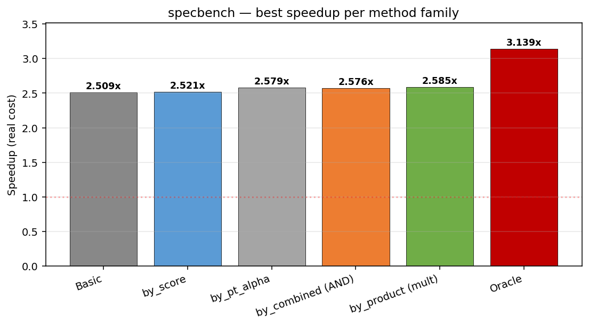
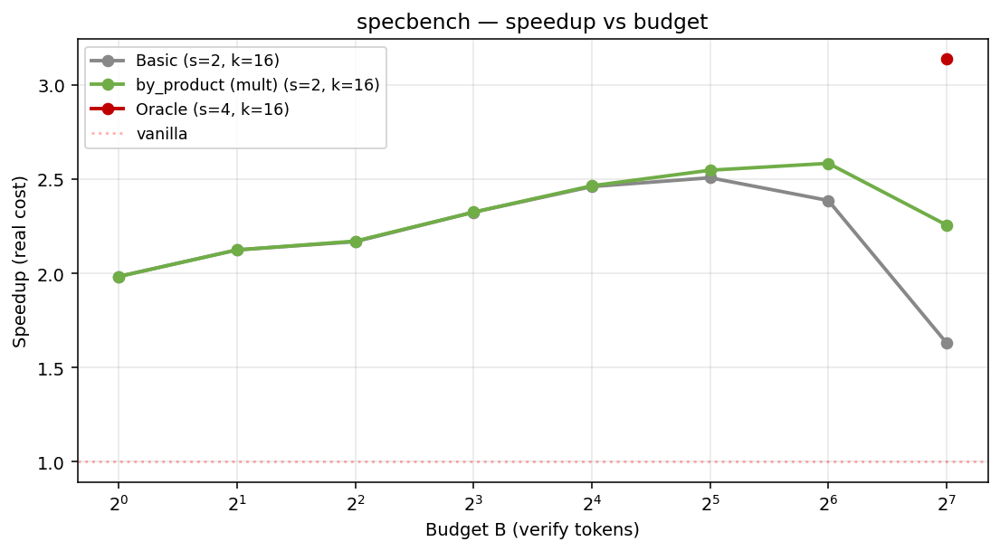
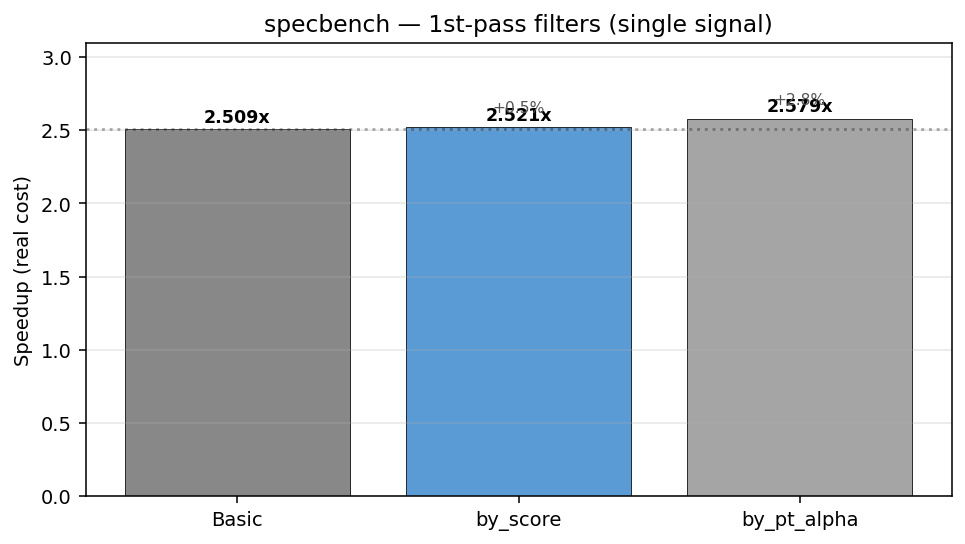
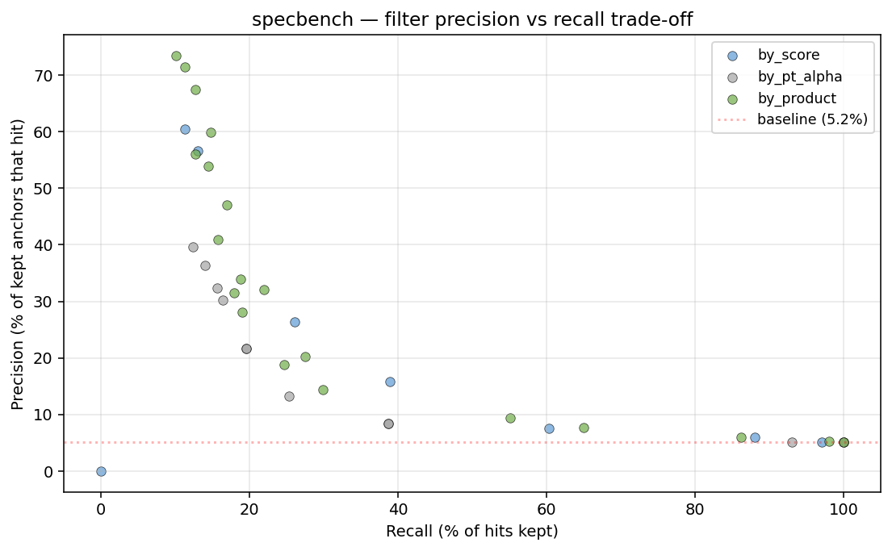
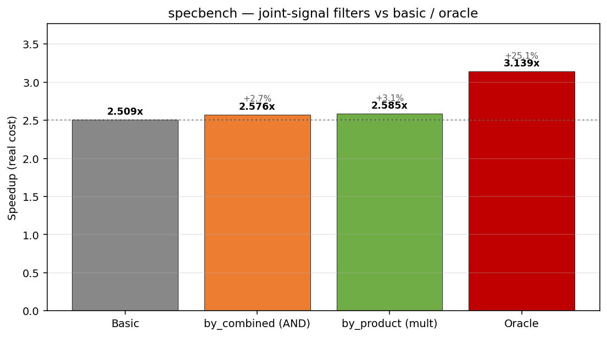
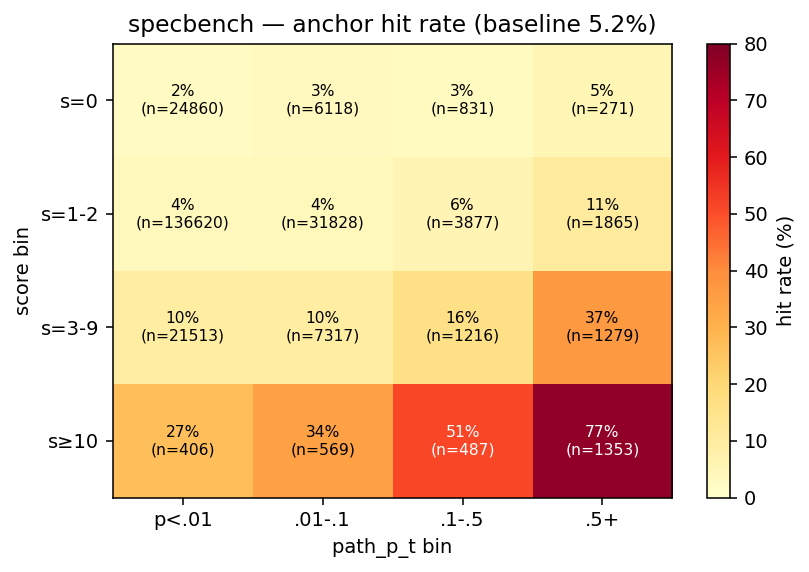
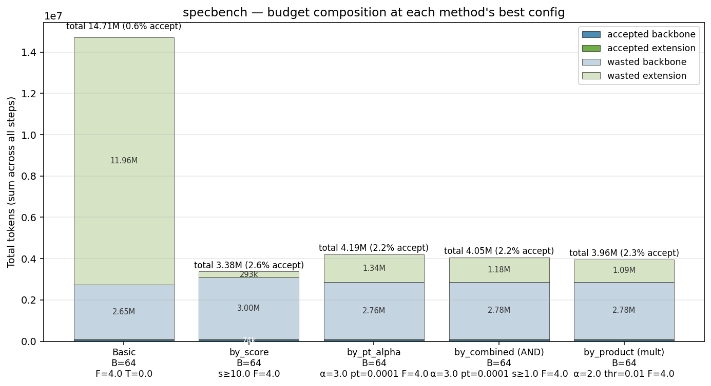
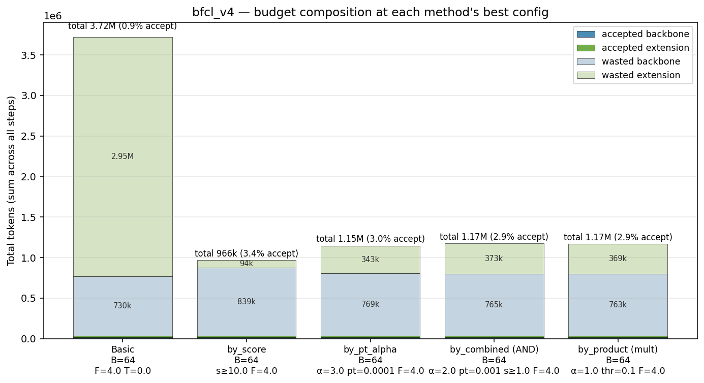
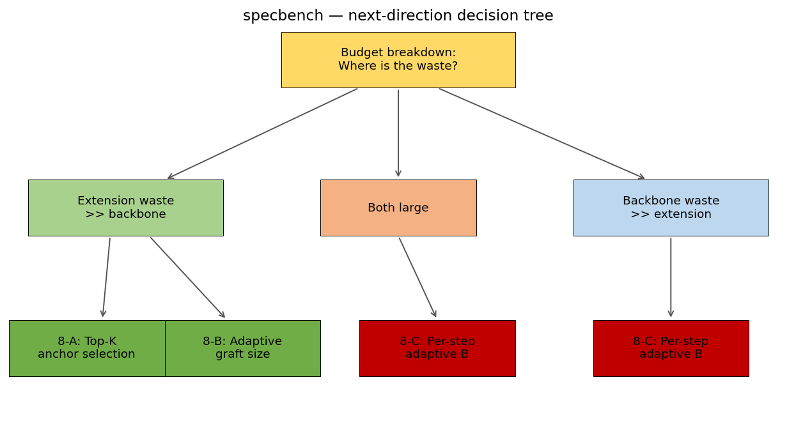

# Extension Filter Research — Progress Report

**2026-05-21**

---

## 0-A. 실험 셋업

**Target model**: Qwen3-14B
**Draft model (backbone)**: EAGLE3 (Qwen3-14B에 fine-tune)
**Suffix tree**: Arctic Inference의 SuffixDecodingCache (live, query-time 학습)
**비교 baseline**: hybrid_e3 (suffix score threshold 기반 fallback)
**Upper bound**: extension_oracle (per-step hindsight optimal B)
**Hardware**: 40-core CPU, simulator (실제 GPU 추론 latency 모델은 latency_config.json — RTX 4090 측정값)

### Workloads (2개)
| ID | 설명 |
|---|---|
| **specbench** | Vicuna/MT-Bench 단답 5000 records |
| **bfcl_v4** | tool calling (BFCL v4, web_search subset) |

### Capture (한 번만, reslice로 재사용)
- s=8, k=16 (최대 깊이/폭)
- 각 step마다 pool에 1808 candidate tokens 저장
- Reslicer로 더 작은 (s', k') 구성 가능 (재캡처 없이)

---

## 0-B. Method 정의

각 anchor 노드 $v$에서:
- $s(v)$ = suffix tree score (anchor query 시 반환)
- $p(v)$ = backbone local edge probability (parent → $v$)
- $\text{path\_p\_t}(v) = \prod_{u \in \text{root} \to v} p(u)$ = backbone 누적 확률

| Method | Anchor keep 조건 | 비고 |
|---|---|---|
| **extension** | (all anchors) | basic. 모든 anchor에 graft |
| **extension_by_score** | $s(v) \geq \tau_s$ | suffix-tree frequency 필터 |
| **extension_by_pt_alpha** | $\text{path\_p\_t}(v)^\alpha \geq \tau_{pt}$ | backbone confidence 필터 |
| **extension_by_combined** | $\text{path\_p\_t}(v)^\alpha \geq \tau_{pt} \land s(v) \geq \tau_s$ | AND 결합 |
| **extension_by_product** | $s(v) \cdot \text{path\_p\_t}(v)^\alpha \geq \tau_{\text{prod}}$ | multiplicative 결합 |
| **extension_oracle** ★ | (all anchors, per-step optimal B) | upper bound, 실제 deploy 불가 |

추가 공통 hyperparam:
- $F$ = suffix max spec factor (anchor의 graft 길이 multiplier)
- $T$ = suffix min token prob (graft 내 token confidence threshold)

---

## 0-C. Sweep grid — 전체 조합

### 공통 차원
- **Reslice (s, k)** ∈ {2, 4, 6, 8} × {2, 4, 8, 16} = **16 reslices**
- **Budget B** ∈ {1, 2, 4, 8, 16, 32, 64, 128} = **8 budgets**
- **F/T**: 통상 {(1, 0), (2, 0), (4, 0)} = 3 pairs (basic은 추가로 T=0.1까지)

### `extension` (basic)
| F | T |
|---|---|
| {1, 2, 4} | {0, 0.1} |
→ **6 hp combos × 16 reslices × 8 budgets = 768 sims**

### `extension_oracle` ★ (upper bound)
| F | T |
|---|---|
| {1, 2, 4} | {0, 0.1} |
→ **6 hp combos × 16 × 8 = 768 sims**

### `extension_by_score`
| score | F | T |
|---|---|---|
| {1, 2, 3, 5, 10, 15, 20} | {1, 2, 4} | {0, 0.1} |
→ **39 hp × 16 × 8 = 4,992 sims**

### `extension_by_pt_alpha`
| α | pt | F | T |
|---|---|---|---|
| {0.5, 1, 2, **3, 5**} | {0.001, 0.01, 0.1, 0.5, **0.0001**} | {1, 2, 4} | {0} |
- 굵게는 boundary 확장에서 추가됨
- **단**: (α=3, pt=0.0001), (α=5, pt=0.0001) 등은 boundary edge에만 enrolled
→ **약 41 hp × 16 × 8 = ~5,248 sims** (boundary 포함)

### `extension_by_combined` (AND)
| α | pt | score | F | T |
|---|---|---|---|---|
| {0.5, 1, 2, **3, 5**} | {0.001, 0.01, 0.1, **0.0001**} | {1, 3, 5, 10, 15} | {1, 2, 4} | {0} |
→ **약 99 hp × 16 × 8 = ~12,672 sims**

### `extension_by_product` (multiplicative)
| α | threshold | F | T |
|---|---|---|---|
| {0.1, 0.25, 0.5, 1, 2} | {0.05, 0.1, 0.5, 2, 5, **0.025, 0.01**} | {1, 2, 4} | {0} |
→ **약 65 hp × 16 × 8 = ~8,320 sims**

### Batch 이력 (변형 추가 순서)
| Batch | 추가된 family / 영역 |
|---|---|
| 초기 | extension, oracle, by_score (score∈{3,10,15}), by_pt_alpha |
| Phase 1 | by_combined (α=1, pt∈{.01,.1}, sc∈{3,10,15}) |
| Phase 2 | by_product (α∈{0.5,1,2}, thr∈{0.5,2,5}) |
| Phase 2.5 (lax extreme) | by_combined α∈{0.5,2}, score=1, by_product α∈{0.1,0.25}, thr∈{0.05,0.1} |
| Phase 3 (boundary edge) | α∈{3, 5}, pt=0.0001 (combined, pt_alpha), thr∈{0.025, 0.01} (product) |
| Breakdown 측정 | best config만 EXTENSION_BREAKDOWN=1로 재실행 |

---

## 0-D. 측정 지표

각 sim 결과 (budget_sweep entry):
- `mat` = mean accepted tokens / step
- `speedup_real` = vanilla_total_time / sim_total_time (실측 latency 적용)
- `total_target_tokens` = sum of ext_size across steps
- **`bd_base_size`** = ∑ backbone tree token (per-step)
- **`bd_graft_size`** = ∑ all attached graft tokens (per-step)
- **`bd_accepted_base`** = ∑ accepted from backbone
- **`bd_accepted_suffix`** = ∑ accepted from graft
- → `wasted_*` = `*_size - accepted_*`

비교 metric:
- **spd** (real-cost): hybrid_e3 또는 basic 대비 % gain
- **Oracle gap** = (oracle_spd - method_spd) / method_spd × 100%

---

## 1. Extension의 동기

- **백본 (EAGLE3/MTP) tree**의 각 노드에 **suffix tree로부터의 graft** 부착
- Base tree가 못 잡는 짧은 sequence (반복 패턴, 변수명 등) accept 가능 → MAT 향상
- **효과 확인**: basic extension이 hybrid_e3 대비 의미 있는 spd 향상

---

## 2. 첫 번째 문제 — Budget 폭증

- 모든 anchor에 graft 부착 → verify token 폭증
- **B=128에서 basic extension spd < 1.0** (vanilla보다 느림)
- 반면 **oracle은 spd 3.07** — per-step adaptive로 cost-MAT 최적화 가능함을 보여줌

→ **anchor를 줄여 cost 통제하자 = filter 도입**

---

## 3. 1차 filter — `by_score`, `by_pt_alpha`

| Method | 의도 | spd gain vs basic |
|---|---|---:|
| `by_score` | Suffix-tree frequency 낮은 anchor 제거 | **+0.5%** |
| `by_pt_alpha` | Backbone confidence 낮은 anchor 제거 | **−2.3%** |

→ 단일 signal로 효과 없음

---

## 4. Filter 실패 원인 — 데이터 기반

1. **Anchor hit rate baseline 5%** — 95%가 wasted
2. **단일 signal 정보량 약함**:
   - `score`: precision 5% → 15% (×2-3 향상 한계)
   - `path_p_t`: 거의 무관 (백본 confidence ≠ anchor accept)
3. **Precision/recall trade ~ 1:1**: strict 올리면 anchor 수 감소 → MAT 손실 > cost saving

---

## 5. 2차 filter — `by_combined` (AND), `by_product` (multiplicative)

| Method | specbench | bfcl_v4 |
|---|---:|---:|
| `by_combined` | +2.5% | +2.2% |
| **`by_product`** ★ | **+3.0%** | **+2.4%** |

여전히 oracle 25% gap의 작은 부분만 메움.

---

## 6. Joint signal — Sweet spot은 명확히 존재

(score, path_p_t) joint binning의 hit rate:

| score \ path_p_t | <0.01 | 0.01–0.1 | 0.1–0.5 | ≥0.5 |
|---|---:|---:|---:|---:|
| s=0 | 2.4% | 2.9% | 2.6% | 5.2% |
| s=1–2 | 3.5% | 4.1% | 5.7% | 10.9% |
| s=3–9 | 9.7% | 9.6% | 16.0% | 36.8% |
| **s≥10** | **26.8%** | **34.4%** | **51.3%** | **77.0%** |

- Sweet spot hit rate **×15** baseline
- 하지만 sweet spot이 **전체 anchor의 1% 미만**, 전체 hits의 13%만 capture
- **Binary filter는 0/1 결정** → signal 강도의 연속체 활용 불가

---

## 7. Budget waste 분리 측정 — 통제된 실험 (B=64, F=4, T=0 통일)

모든 method를 동일 조건에서 비교. 각 method는 자신의 best HP 적용.

**specbench**:
| Method | hp | base | graft | total | accept% |
|---|---|---:|---:|---:|---:|
| Basic | F=4 | 2.71M | **12.0M** | **14.7M** | **0.6%** |
| by_score | s≥10, F=4 | 2.93M | 432k | **3.36M** | **2.6%** |
| by_pt_alpha | α=3, pt=0.0001, F=4 | 2.83M | 1.36M | 4.19M | 2.2% |
| by_combined | α=3, pt=0.0001, s≥1, F=4 | 2.85M | 1.19M | 4.04M | 2.2% |
| by_product | α=2, thr=0.01, F=4 | 2.84M | 1.06M | 3.91M | 2.3% |

**bfcl_v4**:
| Method | hp | base | graft | total | accept% |
|---|---|---:|---:|---:|---:|
| Basic | F=4 | 762k | **2.94M** | 3.71M | **0.9%** |
| by_score | s≥10, F=4 | 875k | 95k | **970k** | **3.4%** |
| by_pt_alpha | α=3, pt=0.0001, F=4 | 793k | 350k | 1.14M | 3.0% |
| by_combined | α=2, pt=0.001, s≥1, F=4 | 793k | 380k | 1.17M | 2.9% |
| by_product | α=1, thr=0.1, F=4 | 793k | 370k | 1.16M | 2.9% |

### 결론
1. **Basic은 B=64에서 cost 폭증** (specbench 14.7M, bfcl 3.7M). Filter 없이는 큰 B 못 씀.
2. **모든 filter가 graft 효과적으로 줄임**:
   - specbench: basic graft 12M → by_score 432k (**−96%**), product 1.06M (−91%)
   - bfcl: basic 2.94M → by_score 95k (**−97%**)
3. **Strict by_score (s≥10)가 graft 가장 잘 통제** — 작은 total + 높은 accept rate
4. **Base는 모두 비슷** (filter는 base 통제 못함, 모두 ~2.85M specbench / ~790k bfcl)

→ Filter의 진짜 가치 = **graft cost-cap**. Base 폭증 통제는 별도 mechanism 필요 (per-step adaptive B).

---

## 8. 돌파구 후보 — Filter 패러다임을 넘어

지금까지의 구조적 한계:
- Filter는 **anchor를 선택할 뿐 budget을 조절하지 못함**
- 절대로 MAT > basic의 MAT를 만들 수 없음 (제거만, 추가 못함)
- Oracle의 +25%는 본질적으로 **per-step adaptive B**에서 옴

---

## 8-A. Cost-aware Top-K

- Anchor를 `score × path_p_t^α`로 정렬 → 상위 K개만 graft
- K는 budget-independent → verify cost가 K로 bounded
- B를 크게 해도 base tree만 커지고 graft cost 일정
- **Filter 패러다임 안에서 가장 surgical한 개선**
- 예상 효과: filter ceiling을 ~5%까지

---

## 8-B. Anchor priority별 adaptive graft size

- High-priority anchor (sweet spot): F=4 (큰 graft)
- Mid-priority: F=2
- Low-priority: F=1 또는 graft 없음
- Sweet spot의 강한 signal을 (binary quantize 없이) **연속적**으로 활용
- Binary filter의 정보 손실 극복

---

## 8-C. Per-step adaptive B (oracle 모방)

- Step 별 anchor pool의 quality 평가 → B를 동적으로 결정
- Easy step → B 작게 (cost 절약), Hard step → B 크게 (MAT 보존)
- **Oracle gain (+25%)의 본질** — 직접 모방하면 가장 큰 임팩트
- 가장 invasive, gating signal 학습/heuristic 필요
- B 결정의 step별 overhead 있음 (trade-off)

---

## 9. 우선순위 결정 — Breakdown이 답을 줌

**관찰 (slide 7)**:
- Base waste 95-98%, graft waste 95-99% — 둘 다 leaky
- Filter는 graft만 통제 → base가 커지면 net saving 없음
- Spd gain의 본질은 MAT 증가, cost 감소 아님

→ **8-C (per-step adaptive B)가 최우선 돌파구**:
- 양쪽 모두 통제 가능 (base, graft 비례 축소)
- Easy step에 작은 B로 양쪽 다 줄임
- Hard step에만 큰 B → MAT 유지
- Oracle의 +25% gain의 메커니즘 직접 모방

**보조 (8-A, 8-B)**: graft만 더 정교화 → cost 더 줄어도 MAT 손실 가능성 → marginal.

**핵심 통찰**: B를 method 단위 정적 선택이 아니라 step 단위 동적 선택해야 함. Filter가 anchor 선택을 step별로 한다면, B도 step별로 선택해야 일관됨.

---

## 10. 요약

- ✅ Filter ceiling 확인 (~+3%)
- ✅ Joint signal sweet spot 존재 확인 (×15 hit rate)
- ✅ Budget breakdown 완료:
  - **Base와 graft 모두 95-99% waste**, 둘 다 leaky
  - Filter는 graft 줄이지만 base를 키워서 net cost ≈ basic
  - 작은 spd gain은 MAT 증가 덕분, cost 감소 아님
- ✅ Filter 패러다임의 구조적 한계 데이터로 확정
- ⏭ **다음 = Per-step adaptive B (8-C)** — base + graft 양쪽 동적 통제
